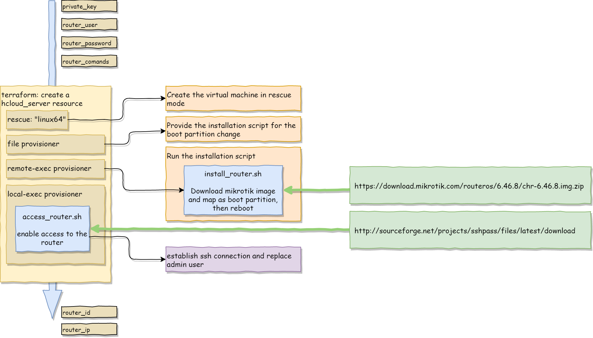

# terraform-hcloud-routeros-router

Terraform code to seamlessly integrate a RouterOS router into a Hetzner Cloud network.

Mikrotik.com provides a software-based router solution as a boot image, which we use here to build fully automated a router box in Hetzner Cloud. 

Terraform provisioniers enable this automation. The installation code relies on an underlying Ubuntu-18.04 on the to-be-installed router as well as on the terraform runner node. The code is tested with Terraform Cloud but should work in local environments too.
Prerequisite is the availability of a C Compiler for the downloaded `sshpass` command. It needs to be built on the spot since Terraform Cloud allows no persistent custom environments.

When running in TFC, the code is here a little flaky since it requires Terraform Cloud runners to provide an Ubuntu environment which is not a guaranteed property of Terraform Cloud. Local runners should work well since you can control how they are set up.

As well, we do have of course the 1-2 seconds interval where we have RouterOS running with an unprotected admin account in the cloud since the softare comes with an admin account with password. However, the code will create a reasonable secured router configuration much quicker than a human operator can.

See [selfscrum/terraform-hcloud-routeros-router-configuration](https://github.com/selfscrum/terraform-hcloud-routeros-router-configuration) for an additional simple  router configuration module.

Enjoy!
-selfscrum

